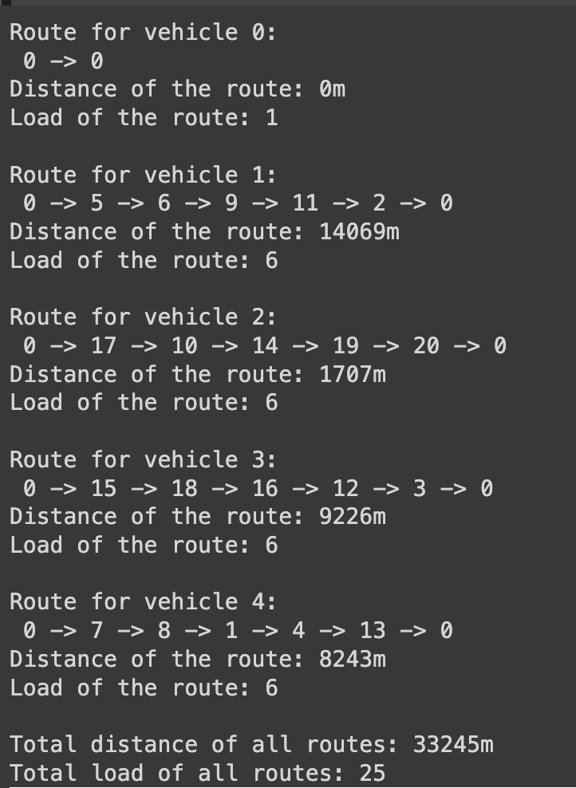
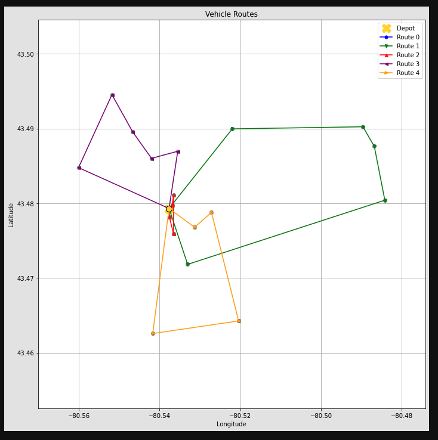

# Vehicle Routing Optimization Project

## Introduction

This project applies the Capacitated Vehicle Routing Problem (CVRP) to enhance delivery logistics for a local restaurant in Waterloo. Utilizing mathematical modeling and optimization algorithms, we aim to boost operational efficiency, reduce costs, and elevate customer satisfaction.

## CVRP Formulation

### Decision Variables
- `xijk`: Binary variable, 1 if vehicle i travels from location j to k, else 0.
- `Loadij`: Continuous variable for the load of vehicle i after visiting location j.

### Objective Function
Minimize the total distance traveled by the fleet:

- `n`: Number of vehicles
- `m`: Number of addresses to deliver to
- `Distancejk`: Distance between address j and k

### Constraints
- Visit each location exactly once, excluding the depot.
- Start and end routes at the depot (local restaurant).
- Vehicle load should not exceed capacity.
- Load changes after each delivery.
- No subtours or depot revisits mid-route.

## Features
- **Mathematical Optimization**: Minimizes total travel distance with constraints.
- **API Integration**: Uses Google's Distance Matrix API for distance calculations.
- **Visualization**: Employs Folium for interactive mapping and Matplotlib for plotting.

## Requirements
- Python 3.x
- Pandas
- Google Maps API
- OR-Tools
- Folium
- Matplotlib

## Report
For a detailed analysis and insights, refer to the complete report: [VRP_GITHUB/Report.pdf](VRP_GITHUB/Report.pdf)

## Team Member
- Banat Khural - [GitHub](https://github.com/sanyaorbanat)

## Course
CO 370: Deterministic OR Models  
Instructor: Martin Pei - [Profile](https://www.math.uwaterloo.ca/~mpei/)

## Key Findings
- **Efficiency Improvement**: Reduction in operational costs and enhancement of customer service through route optimization.
- **Practical Application**: Real-world application of theoretical models, linking academic concepts with business needs.
  

## Conclusion
- **Business Impact**: Highlights the significance of route optimization in local business competitiveness and efficiency.
- **Future Scope**: Discusses potential enhancements, including scalability and real-time traffic data integration.

## Visualization Output

For an interactive view of the routes, see the HTML map file: 

(Note: The HTML file is best viewed in a web browser.)
